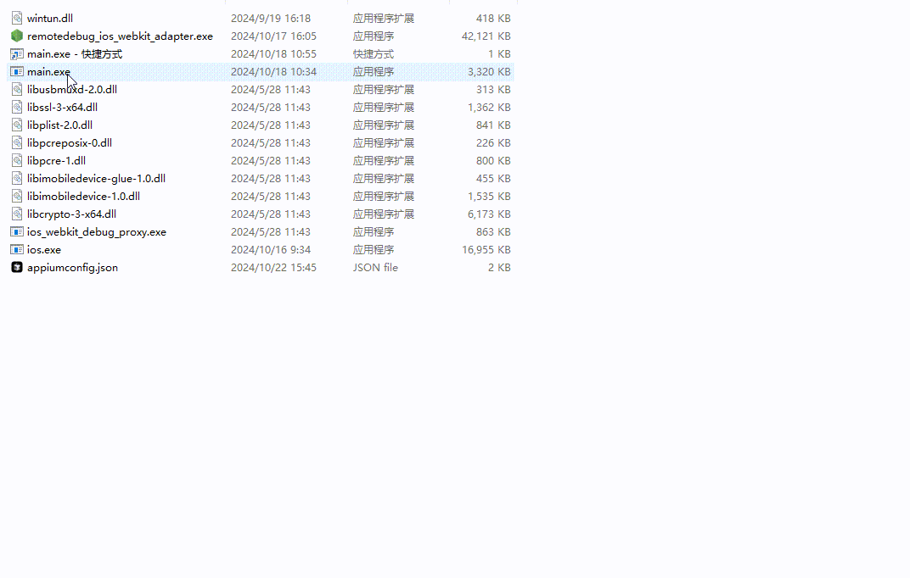
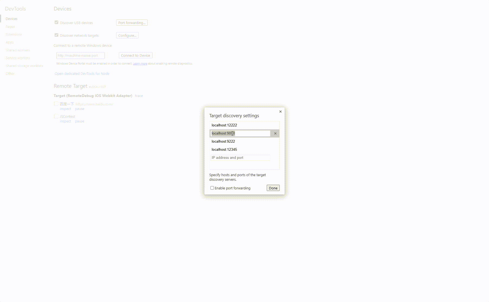

# remotedebug-ios-webkit-adapter-runner
- 基于remotedebug-ios-webkit-adapter的iOS Webkit Adapter Runner打包后的可执行文件，并修复了一下devtool崩溃问题，当前go的作用仅作为一个启动器
- 已release到[github](https://github.com/1103837067/remotedebug-ios-webkit-adapter-runner),直接下载zip即可
- 解压文件后打开main.exe,输入端口后回车确认可自动启动服务，可创建快捷键到桌面方便使用

# 启动

# 启动后成功打开devtool

